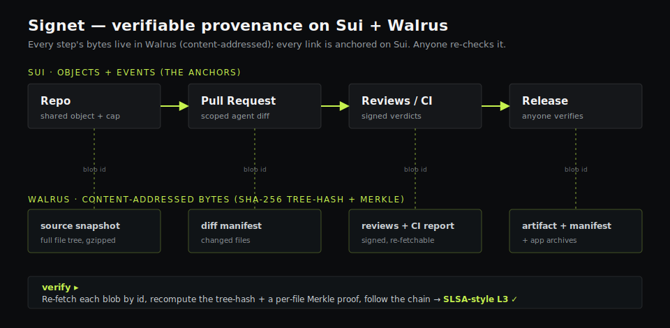

# Signet

[](https://github.com/kravadk/signet/actions/workflows/ci.yml)
[](LICENSE)
[](#live-deployments)
[](FUNCTIONS.md)
[](SECURITY.md)
[](https://signet-sui.vercel.app)

**Describe an app → an AI builds it live → publish it to Walrus + Sui with verifiable provenance.**

Built for **Sui Overflow 2026** · primary track: **Walrus** · secondary: **Agentic Web**.

**Live:** [signet-sui.vercel.app](https://signet-sui.vercel.app) · **Verify a release yourself** (zero setup): [signet-sui.vercel.app/app#verify](https://signet-sui.vercel.app/app#verify) · **Contracts:** [testnet](https://suiscan.xyz/testnet/object/0x79816a1e711ae601afb2ea4ffa5ae83a906c0615ec0831673be8955fa11e4bd5) · [mainnet](https://suiscan.xyz/mainnet/object/0x9db741d5dfea02b1aadedaff43e73bde3972adf82beadf7cc6da26f107bfbc54)

Signet is two products sharing one trust layer:

1. **Playground** — the front door. Describe an app, an LLM builds it in your browser, and you
   publish it to a public gallery where every number (visits, stars, tips, remix lineage,
   builder reputation) is **on-chain and unfakeable**.
2. **Agent-native release network** — repositories, pull requests, agent reviews, CI and
   verifiable release chains, where humans *and* AI agents ship code under the same
   capability-scoped, on-chain permissions — with a `verify` that anyone can run.

The release network is what makes the Playground's authorship and metrics trustworthy:
everything is content-addressed in **Walrus** and anchored by **Sui** objects, capabilities and
events — re-checkable by anyone, not a screenshot.



---

## For judges — evaluate in ~90 seconds

1. **Watch a release verify itself, zero setup** → **[signet-sui.vercel.app/app#verify](https://signet-sui.vercel.app/app#verify)**. It opens green: re-fetches the Walrus blobs, recomputes the SHA-256 tree-hash + a per-file Merkle proof, follows the chain, and reports **SLSA-style L3**. Share a specific one with `…/app#verify?release=<id>`.
2. **Describe → AI builds → publish** → **[/app#playground](https://signet-sui.vercel.app/app#playground)**. An LLM builds an app live in the browser; Publish stores the bytes on Walrus and anchors a `PublishedApp` on Sui.
3. **Real on-chain data, no database** → **[/app#repos](https://signet-sui.vercel.app/app#repos)**. 33 repositories read live from chain, including real GitHub imports (a 266 MB repo reduced to 12.5k source files). Every number in the app comes from Sui + Walrus.

| | |
|---|---|
| **Live** | testnet **and** mainnet, both verified on-chain — [testnet pkg ↗](https://suiscan.xyz/testnet/object/0x79816a1e711ae601afb2ea4ffa5ae83a906c0615ec0831673be8955fa11e4bd5) · [mainnet pkg ↗](https://suiscan.xyz/mainnet/object/0x9db741d5dfea02b1aadedaff43e73bde3972adf82beadf7cc6da26f107bfbc54) |
| **On Walrus** | source snapshots, PR diffs, signed reviews, CI reports, release artifacts + manifests, app archives — content-addressed, tree-hash + Merkle |
| **On Sui** | repos, PRs, reviews, releases, reputation, bounties, payments, apps — objects + events; every write gated by a capability |
| **Agents** | MCP server, 22 tools; each bound to a scoped, expiring `AgentCap` — an agent can propose and review but **never** merge or release |
| **Tests** | Move 66/66 · on-chain e2e 18/18 · Playwright 20/20 · app 17/17 · server 17/17, all reproducible |
| **Stack** | Sui Move (8 modules) · Walrus · Seal · zkLogin · MCP · static JS SPA (no framework, no build step) |

**Why it's different:** an agent's work is normally unverifiable — screenshots and trust. Signet makes the whole chain **Repo → PR → Reviews/CI → Release** content-addressed on Walrus and anchored on Sui, so anyone re-derives the proof with no key and no trust in us. Permissions are capabilities, not an allow-list; reputation is `public(package)` bump-only, so scores can't be forged off-chain.

---

## Table of contents
- [For judges](#for-judges--evaluate-in-90-seconds)
- [Playground](#playground)
- [Release network](#release-network)
- [Trust model](#trust-model)
- [Live deployments](#live-deployments)
- [Architecture](#architecture)
- [Move contracts & error codes](#move-contracts--error-codes)
- [Run it](#run-it)
- [CLI reference](#cli-reference)
- [MCP server (agent-native)](#mcp-server-agent-native)
- [SDK](#sdk)
- [Read layer and data-source parity](#read-layer-and-data-source-parity)
- [Payment links and invoices](#payment-links-and-invoices)
- [Verify a release (SLSA-style)](#verify-a-release-slsa-style)
- [Backend P0 services (optional)](#backend-p0-services-optional)
- [Hosted Gateway + webhooks](#hosted-gateway--webhooks)
- [Automation](#automation)
- [Operations & hardening](#operations--hardening)
- [Testing and quality gates](#testing-and-quality-gates)
- [Why Sui + Walrus](#why-sui--walrus)
- [What makes it different](#what-makes-it-different)
- [Who it's for](#who-its-for)
- [Tech stack](#tech-stack)
- [Security notes](#security-notes)
- [Project status](#project-status)
- [Docs](#docs)
- [License](#license)

---

## Playground

In the browser, describe an app; a real LLM generates a self-contained web app, you see it run
instantly in a sandboxed `<iframe>` preview, and you publish it on-chain.

**Typical flow:**
1. Open the **Playground** tab (the default). Either paste an Anthropic key (BYOK) or, if a
   hosted proxy is configured, just type — no key needed.
2. Type a prompt ("a pomodoro timer with a ring"). The LLM returns a complete app; the preview
   updates live. Iterate by typing more instructions.
3. Click **Publish**. Choose storage: **Free · temporary** (public Walrus publisher) or
   **Paid · you own it** (uploaded via the `@mysten/walrus` SDK for a chosen number of epochs,
   your wallet pays the WAL). The app's gzip archive + a manifest go to Walrus; a `PublishedApp`
   object anchors the provenance on Sui.
4. The app appears in the public **gallery** with live on-chain metrics. Open it via a canonical,
   verifiable **🔗 Share** link (the viewer re-verifies the content tree-hash against the chain).

**Every gallery app carries provenance a centralized clone can't fake:**

| Capability | On-chain mechanism |
|---|---|
| Provenance | builder, content **tree-hash**, prompt, **remix lineage** (`parent`) on `PublishedApp` |
| Unfakeable metrics | `record_visit` / `star` / `tip` — one star per address, no self-star |
| Builder reputation | `BuilderBoard` score = `apps·5 + stars·3 + remixes·4`, emits `BuilderScored`; profile reads it live via devInspect |
| Remix → reputation | `publish_remix_v3` credits the **parent** builder a remix (self-remix can't farm score) |
| Community moderation | `FlagRegistry`: flag spam (one/address) or hide your own app; gallery hides hidden + ≥3-flag apps |
| In-place versioning | `update_app` re-anchors the **same object**; old blobs persist, `AppUpdated` = version log |
| Handles | `NameRegistry`: claim a unique `@handle` (one/address); shown instead of an address |
| Monetization | `tip_app_v2` routes a 2.5% fee to an on-chain `Treasury`; **app bounties** escrow SUI for an app you want built |
| Paid fork | `set_fork_price` / `pay_to_fork` — a builder charges to remix their app; the fee (minus 2.5%) is paid to them on-chain, the remix is licensed atomically |
| Private apps | `set_private` + **Seal** policy `seal_approve_app_owner`; v2 adds `WorkspaceRegistry` + `seal_approve_app_member` so builders can allowlist collaborators without changing old owner-only apps |
| Durable storage | choose epochs at publish; **⏳ Renew** re-pins bytes (content-addressed → on-chain id never changes) |
| Real share URL | `viewer.html?app=<id>&net=<net>` — fetches from Walrus + re-verifies the tree-hash |
| Per-app Walrus Site | optional: mint a real `Site` object via the Walrus Sites package |

Apps live on Walrus; the trust layer lives on Sui. The on-chain record is permanent; only the
runnable *bytes* expire if storage isn't renewed — and the tree-hash means anyone can re-pin the
exact same app and it still verifies.

**Onboarding:** by default you connect a Sui wallet and pay your own gas — a fraction of a cent
(~0.002 SUI) per action. Three **optional** accelerators in `server/` remove the remaining friction
(see [Backend P0 services](#backend-p0-services-optional)): a hosted LLM proxy (build with no API
key), plus zkLogin + a gas sponsor (sign in with Google, act without holding SUI). A Move contract
can't pay gas on Sui, so gasless is always an optional off-chain accelerator — never required.

---

## Release network

Under the Playground sits a full agent-native release network. The entire provenance chain —

```
source snapshot → PR diff → agent review → CI test report → release artifact
```

— is content-addressed in Walrus and anchored by Sui objects, capabilities and events. Anyone
can independently verify a release: every node in the chain is a real Walrus blob and a real
on-chain object, not a screenshot.

- **Repositories** with an owner cap and a clean global name namespace.
- **Pull requests** with stale-base-guarded merges and signed agent **reviews**.
- **Releases** that bind a tag to a reviewed source + artifact + report.
- **Issues**, **comments**, and **on-chain SUI escrow bounties** (post / claim / submit / approve
  / cancel), claim-gated by reputation.
- **Payment links / invoices** with shared `PaymentRequest` objects, QR/copy links, paid /
  cancelled / expired states, and `payment.paid` webhooks.
- **CI agent** that fetches a snapshot, runs `sui move test`, and posts a signed review on-chain.

---

## Trust model

Reputation and permissions are **contract checks, not server policy**:

- **RepoOwnerCap** — only the owner can update refs, merge PRs, publish releases.
- **AgentCap** — delegated, *scoped* (`open_pr` / `review` / `run_ci`), epoch-expiring, and
  **owner-revocable** (instant kill-switch). Agents propose, review and run CI; they can **never**
  merge or release.
- **Agent reputation** — `merged·10 + reviews·3 + CI·2 + vouches·5`, recomputed on every signed
  action and stored on the `AgentProfile`.
- **Vouching** — an agent with score ≥ 10 can vouch for another (once per pair, no self-vouch).
- **Threshold-gated merge** — the owner sets `min_approvals`; `merge_pr` aborts without that many
  APPROVE reviews.
- **Reputation-locked bounties** — a funder can require `min_score` to claim.
- **Builder reputation (Playground)** — `BuilderBoard`, credited on publish/star/remix.
- **Community moderation (Playground)** — `FlagRegistry`, flag/hide enforced on-chain.
- **In-place versioning / handles / Treasury / app-bounties / paid-fork (Playground)** — all on-chain (above).
- **Private apps (Playground, Seal)** — `set_private` + `seal_approve_app_owner` remains the
  backward-compatible default. Team-private v2 adds `WorkspaceRegistry`,
  `invite_workspace_member` / `revoke_workspace_member`, and `seal_approve_app_member`, so an
  app builder can allowlist collaborators while old private apps stay owner-only.
- **Private agent memory (Seal)** — private repo snapshots and encrypted review notes live on
  Walrus encrypted with **Seal**; key servers call `forge::seal_approve_owner` /
  `seal_approve_agent`, which abort unless the requester holds a cap for the repo whose object-id
  namespaces the encryption identity. Decryption is gated by the **same on-chain capability** as
  everything else.

### Other niceties
- **SuiNS** reverse-resolution: addresses render as their SuiNS name where one exists.
- **GraphQL data source (beta)**: append `?graphql=1` to read events, objects and balances through
  Sui GraphQL. JSON-RPC remains the reliable fallback and the UI shows the active/degraded source.

---

## Live deployments

### Sui testnet
| | |
|---|---|
| Forge package | `0x07b63031a435ba7e38909e858c97e9bb6cad14ca5cb51dc9d1fdb9720f237de1` |
| ForgeRegistry (shared) | `0x526227556a1e1da65fe2612423e4b8223b8ad38c3d516d9bc62f975d00796a02` |
| **Latest upgrade — all writes target this (v12)** | `0x79816a1e711ae601afb2ea4ffa5ae83a906c0615ec0831673be8955fa11e4bd5` |
| StarRegistry · BuilderBoard · FlagRegistry | `0xa20bdff4…1167e2` · `0xec1eeaf5…c62fa2f` · `0x48068f76…5268a046` |
| NameRegistry · Treasury | `0xf802954a…d8b62f10` · `0x9062ed0b…d89ad921` |
| ForkRegistry · PrivacyRegistry | `0xc774e8ca…d753909` · `0x1c331210…f8ecd20f` |
| ReliabilityLedger (agent SLA) | `0x15fdb90609f55671830f285b2595463503b2e3e5310fa3d9f2789770b14c1973` |
| Web (Walrus Site) | site `0x38d99f627aff840d309628f1b1478d4533654fab7117ed030a3dccb5125d2b97` · subdomain `1f0c5k3c47udwnlh4a978yhmzqyt0drtnbgcdoo95ag27jgb6f` |

### Sui mainnet
| | |
|---|---|
| Forge package | `0x9db741d5dfea02b1aadedaff43e73bde3972adf82beadf7cc6da26f107bfbc54` |
| **Playground package (paid-fork + private apps)** | `0x60e6933e4b92c4deb2f9afb37c143581d1bd589b2f2a32d76c9c2189a287b36a` |
| StarRegistry · BuilderBoard · FlagRegistry | `0xa5c1f472…d4dd7882` · `0x30554909…13fc846b` · `0x50150e7d…f0ae52c952` |
| NameRegistry · Treasury | `0xfd2c19e1…bc2acf1f` · `0x37be3e8a…45f82` |
| ForkRegistry · PrivacyRegistry | `0x37f94756…d9aff6b7` · `0xe8603766…8ef19935` |

Full ids for both networks (plus the upgrade chain) live in `move/signet/deployments.json`
and `web/shared.js`. The testnet package is on its **12th upgrade**: v10 added bounty
dispute/arbitration + on-chain agent SLA (`ReliabilityLedger`), v11 added app version history
(diff / rollback / remix-from-version via `AppUpdatedV2`), and v12 added the `payment` module
(payment links / invoices). Event types stay under the original ids; writes target v12.

**Move Registry (MVR):** the package is published under the intended alias `@signet/forge`
(`mvrName` in `deployments.json`). Once registered against a SuiNS name via
[moveregistry.com](https://www.moveregistry.com), tooling can target
`@signet/forge::forge::create_repo` instead of the raw `0x…` id. MVR is additive —
everything works today with the raw package id.

> **Events vs writes.** Event types keep the *original* package id where each module first
> appeared, so the gallery reads `AppPublished`/`BuilderScored`/… under `playgroundEventPkg`
> while writes target the latest upgrade (`playgroundPackageId`). Both ids are in the config.

> **Static + decentralized.** The UI is a static SPA published **on Walrus Sites** — code, data
> and the site itself live on Sui + Walrus. It reads live data directly from a Sui fullnode RPC +
> the Walrus aggregator with **no required backend**. The optional `server/` services are
> accelerators only. (The public `wal.app` portal serves mainnet sites only; for testnet,
> self-host a portal at the subdomain or run `npx serve web`.)

A demo repo (`counter-demo-v2`) has gone through an agent-opened PR, a CI-agent review, an owner
merge, and a published release `v0.2.0` — all on live testnet.

---

## Architecture

```
move/signet/      Sui Move contracts (the trust layer) - 8 modules, 66 tests
  sources/
    forge.move           Registry, Repository, RepoOwnerCap, AgentCap (scoped + revocable)
                         + Seal access policy (seal_approve_owner / seal_approve_agent)
    pull_request.move    PullRequest, Review, merge (stale-base guarded) + reputation hooks
    release.move         Release — the verifiable provenance chain
    issue.move           Issues + comments
    bounty.move          On-chain SUI escrow bounties (post/claim/submit/approve/cancel)
    reputation.move      Per-repo AgentProfile counters (PRs/reviews/CI) + vouching
    payment.move         Shared PaymentRequest invoices (create/pay/cancel) + receipts
    playground.move      PublishedApp (provenance, visits/stars/tips, remix lineage)
                         · StarRegistry · BuilderBoard (BuilderScored) · FlagRegistry
                         · NameRegistry (@handles) · Treasury (tip_app_v2 / withdraw_treasury)
                         · update_app (versioning) · publish_remix_v3 · AppBounty (post/award/cancel)
                         · ForkRegistry (set_fork_price / pay_to_fork) · PrivacyRegistry
                         · seal_approve_app_owner / seal_approve_app_member (Seal private apps)
  tests/                 66 tests across forge + playground + payment

app/                   TypeScript CLI + SDK + MCP server + CI worker
  src/lib/*.ts           walrus / snapshot / sui (PTBs) / forge-read / actions (verifyRelease)
                         + typed artifact memory records
  src/clients.ts         typed Signet clients: Forge/Release/Bounty/Playground/Agent/Issue/Payment
  src/cli/index.ts       14 commands (see CLI reference)
  src/mcp/server.ts      MCP server (stdio) - 22 tools incl. Sui primitives + dry-run
  src/ci/worker.ts       CI agent: snapshot → `sui move test` → report → on-chain review

server/                Optional backends — NONE required by the web UI
  src/index.ts           indexer/gateway: cursor-polls Move events into SQLite and serves /api/*
                         with source/cache/cursor/partial metadata + webhooks
  llm-proxy/             Anthropic relay (no BYOK)
  sponsor/               sponsored-tx service (gas-free, value-free calls only)
  salt/                  zkLogin salt service (stateless HMAC salt from a verified JWT)
  portal/                public portal: human /app/:id + /@handle URLs, Open Graph
                         share cards, per-request tree-hash verify (+ /api/apps JSON)

web/                   Static SPA — no backend, no build step (ES modules via esm.sh)
  index.html             SPA shell; Playground default, then 11 release-network tabs
  playground.js          chat → LLM → snapshot → publish → gallery → remix/update/renew →
                         tip → app bounties → paid-fork → private apps → @handle → share/viewer
  seal.js                Seal encrypt/decrypt for builder or allowlisted private app members
  zklogin.js             Sign in with Google (zkLogin), sponsor-aware execution
  wallet.js              wallet-standard connect/sign (sponsored + zkLogin aware) + SuiNS
  viewer.html            renders a published app from Walrus + re-verifies its tree-hash
  app.js                 reads Sui RPC/GraphQL + Walrus in-browser; verify/diff client-side
                         + payment links / QR / package trust / provenance graph
  data-source.js         read adapter: json-rpc / graphql / grpc-requested fallback
  wallet-adapter.js      dApp Kit-style wallet/account/network state facade
  shared.js              per-network config (mirrors deployments.json), client, state
  ui.js / styles.css     toasts/modals + theme (Sui blue; Plus Jakarta Sans + JetBrains Mono)

demo/run.sh            one-command live end-to-end (init→PR→CI→merge→release)
```

---

## Move contracts & error codes

`playground.move` abort codes (useful when reading failed txs):

| Code | Constant | Meaning |
|---|---|---|
| 0 | `EAlreadyStarred` | one star per address |
| 1 | `ECannotStarOwn` | a builder can't star their own app |
| 2 | `EZeroTip` | tip must be > 0 |
| 3 | `EAlreadyFlagged` | one flag per address |
| 4 | `ENotBuilder` | only the builder may hide / update the app |
| 5 | `ENameTaken` | handle already claimed |
| 6 | `ENameNotOwned` | release a handle you don't hold |
| 7 | `ENotAdmin` | only the Treasury admin may withdraw |
| 8 | `ENotPoster` | only the bounty poster may award / cancel |
| 9 | `EBountyClosed` | bounty already awarded / cancelled |
| 10 | `EZeroReward` | bounty reward must be > 0 |
| 11 | `ENotForkable` | app has no fork price set (free to remix / not for sale) |
| 12 | `EUnderpaid` | payment below the builder-set fork price |
| 13 | `ENotAppOwner` | Seal: only the app's builder may decrypt |
| 14 | `ESealIdMismatch` | Seal: identity not namespaced to this app |

Key events: `AppPublished`, `AppVisited`, `AppStarred`, `AppRemixed`, `AppTipped`, `AppFlagged`,
`AppHidden`, `AppUpdated`, `BuilderScored`, `NameClaimed`, `NameReleased`, `TreasuryWithdrawn`,
`AppBountyPosted`, `AppBountyAwarded`, `AppBountyCancelled`, `ForkPriceSet`, `AppForkPaid`,
`AppPrivacySet`.

---

## Run it

### Contracts
```sh
cd move/signet
sui move test          # 66/66 pass
sui client upgrade     # upgrade (uses the UpgradeCap; writes Published.toml)
```

### Web (static dashboard, no build)
```sh
cd web && npx serve -l 4317 .   # http://localhost:4317
```
Pure static `index.html` + ES modules — no bundler, no backend. Reads live data straight from a
Sui fullnode RPC and the Walrus aggregator. The same files get published to Walrus Sites. (Any
static host works — e.g. `cd web && npx vercel --prod`, Root Directory `web`, Framework Preset
Other, empty build command; `web/vercel.json` enables clean URLs.)

A marketing **landing page** lives at `/` (`web/landing.html`, with live on-chain stats, an
interactive in-browser release verifier, and live-rendered Playground apps); the app itself is at
`/index.html` (`/app`) — `web/vercel.json` rewrites `/` → the landing.

**Dev tooling:** `npm run dev:doctor` checks the Sui CLI, package ids, Walrus endpoints and the
optional `sponsor / salt / portal / indexer` services in one shot. A starter template lives in
`examples/create-signet-app` (wallet connect, publish, verify, and payment-link examples).

---

## CLI reference

Installable as `@signet/cli` (the package also ships the MCP server + an SDK):
```sh
npx @signet/cli <command>      # zero-install
npm i -g @signet/cli && forge <command>   # or global `forge` / `signet`
# from the repo: cd app && npm install && npm run forge -- <command>
```

| Command | What it does |
|---|---|
| `forge init --name <n> --dir <path>` | create a repo + snapshot the directory to Walrus |
| `forge import --url <github-url> [--branch <b>]` | import a GitHub repo: clone → snapshot → Walrus → on-chain repo |
| `forge push-snapshot --repo <id> --dir <path>` | push a new source snapshot / update the ref |
| `forge grant-agent --recipient <addr> [--scopes …]` | mint a scoped, expiring AgentCap |
| `forge revoke-agent --cap <id>` | revoke an AgentCap (instant kill-switch) |
| `forge open-pr --cap <id> --title <t> --dir <path>` | agent opens a PR from a snapshot |
| `forge review --cap <id> --pr <id> --report <file>` | submit a signed review (APPROVE/REJECT) |
| `forge merge --pr <id>` | owner merges (aborts below `min_approvals`) |
| `forge close-pr --pr <id>` | owner closes an open PR without merging |
| `forge release --tag <v> --artifact <file> --report <file> [--pr <merged-pr-id>]` | publish a release; `--pr` records the v2 direct PR → release link |
| `forge set-approvals --n <k>` | require k APPROVE reviews before merge |
| `forge vouch --subject <addr>` | raise an agent's trust score |
| `forge verify --release <id>` | independent provenance check (no key) — prints SLSA level |
| `forge attestation --release <id> [--out file.json]` | export an in-toto/SLSA-style release statement |
| `forge prove-file --release <id> --path <p>` | Merkle inclusion proof — prove one file is in a release without downloading the whole archive |
| `forge latest-release` | resolve the newest release on the active network |
| `forge post-bounty-v2` · `claim-bounty` · `open-dispute` · `resolve-dispute` · `cancel-expired` | bounty escrow with deadlines + proof, and owner-arbitrated disputes (partial payout, fee → treasury) |
| `forge renew --app <id>` | re-pin a published app's Walrus blobs for more storage epochs |
| `forge doctor` | environment / config health check |
| `forge status` | repos / PRs / releases overview |

Full command index (24) and the Move/MCP/SDK/web/service surfaces → [FUNCTIONS.md](FUNCTIONS.md).

---

## MCP server (agent-native)

Agents drive Signet through an MCP server that signs with the **agent's own key**, bounded
by the agent's on-chain `AgentCap`. The server exposes **22 tools** — Signet reads (`repo_*`,
`release_*`, `issue_list`, `bounty_list`, `agent_reputation`), write-like Signet tools
(`pr_create`, `review_submit`, `bounty_claim`, `app_publish`, …) and Sui primitives
(`sui_balance`/`object`/`tx`/`events`, `sui_faucet_testnet`). Full list → [FUNCTIONS.md](FUNCTIONS.md).

Write-like tools support `dryRun: true`, returning a structured plan without a key, upload or
signature. Normal writes still require `FORGE_AGENT_KEY` and the matching on-chain cap/scope.

`merge` and `release` are **absent by design** — an agent can never call them.

```json
{ "mcpServers": { "signet": {
  "command": "npx",
  "args": ["-y", "-p", "@signet/cli", "signet-mcp"],
  "env": { "FORGE_AGENT_KEY": "suiprivkey1..." }
}}}
```

Write tools fail cleanly when the cap lacks the needed scope (a review-only cap can't open a PR) —
proving the agent cannot exceed its delegated permissions.

## SDK

The same primitives are importable from `@signet/cli/sdk`:

```ts
import { makeContext, signetClients, verifyRelease, listRepos } from "@signet/cli/sdk";

const ctx = makeContext("testnet");
const repos = await listRepos(ctx);
const result = await verifyRelease(ctx, releaseId);   // SLSA-style provenance check
console.log(result.level, result.steps);

const signet = signetClients(ctx);
const payment = await signet.payment.create({
  recipient: ctx.address,
  label: "Starter invoice",
  amountMist: 100_000_000,
});
```

(The package ships TypeScript and runs via `tsx`; import it from a `tsx`/bundler context.)
Full export list (builders, reads, Merkle, Walrus, typed clients, types) → [FUNCTIONS.md](FUNCTIONS.md).

---

## Read layer and data-source parity

The static SPA reads directly from Sui and Walrus, but the read path is now transport-aware:

- `web/data-source.js` exposes `json-rpc`, `graphql`, and `grpc` request modes.
- `?graphql=1` performs real GraphQL reads for events, objects and balances where the Sui
  GraphQL schema supports the required shape.
- `?grpc=1` attempts **real** `@mysten/sui` gRPC reads (Core API: balance/objects) and falls back
  to JSON-RPC with the actual error if the browser/endpoint can't reach it. The gRPC Core API has
  no event query, so events stay on JSON-RPC (stated honestly, never faked).
- The UI shows `Live RPC`, `GraphQL`, `Indexer cache`, or `Degraded` instead of silently hiding
  partial data.
- CLI/MCP-side event scans expose partial/cursor/error metadata instead of repeated first-page
  polling or silent partial reads.

JSON-RPC remains the reliable fallback until the Sui gRPC/GraphQL paths cover every production
read with the same stability as the fullnode JSON-RPC API.

---

## Payment links and invoices

`payment.move` adds an additive Signet-native payment layer:

- `PaymentRequest` shared object with creator, recipient, label, amount, optional expiry, payer,
  paid/cancelled flags and timestamps.
- Events: `PaymentRequested`, `PaymentPaid`, `PaymentCancelled`.
- PTB helpers and typed SDK client: `createPaymentRequest`, `payPaymentRequest`,
  `cancelPaymentRequest`, `PaymentClient`.
- Gateway endpoints: `GET/POST /payments`, `GET /payments/:id`.
- Web UI: payment list, create modal, optional expiry, QR/copy link, pay/cancel actions, explorer
  links, and explicit `open`, `paid`, `cancelled`, `expired` states.
- Webhook event: `payment.paid` with network, object id, tx digest, event seq, amount, payer,
  recipient and reverify anchors.

Gateway `POST /payments` intentionally returns an unsigned transaction intent. The gateway never
signs or moves user funds; wallets, CLI or SDK clients submit the payment transaction.

---

## Verify a release (SLSA-style)

`forge verify` (and the web **Verify** tab, and the MCP `release_verify` tool — three surfaces,
one read-only verifier) walks the provenance chain and re-checks it independently:

1. every blob is fetchable on Walrus,
2. the source manifest's `treeHash` recomputes from the actual files,
3. a merged, *reviewed* PR's head matches the released source.

So the code that was reviewed is provably the code that was released. It prints per-step PASS/FAIL
and a **SLSA-style level**: L1 (source+artifact) · L2 (+ signed review) · L3 (+ full chain
matches). No key, no account, no trust in us.

**Per-file Merkle proofs.** Each snapshot manifest also carries a `merkleRoot` over the file
leaves, so you can prove a *single* file belongs to a release with an O(log n) inclusion proof —
without downloading the whole archive. `forge prove-file --release <id> --path <p>` (and the **⛓
prove** button on each file in the web file tree) recompute and check the proof against the
on-chain-anchored root.

---

## Backend P0 services (optional)

All in `server/`, Node 18+, **accelerators not sources of truth** — reads/writes that matter stay
on Sui + Walrus, and the client degrades to the self-serve path if a service is absent.

### `server/llm-proxy` — build without an Anthropic key
Holds one key server-side, forwards `prompt → completion`. Model allowlist, `max_tokens` cap,
per-IP rate limit, CORS-locked.
```sh
cd server/llm-proxy && ANTHROPIC_API_KEY=sk-ant-... npm start   # :8787
```

### `server/sponsor` — act without SUI (gas-free)
Co-signs gas for **value-free** playground calls only (record_visit, star, flag, set_hidden,
claim_name, publish, update); rejects value-moving calls (tip/bounty/withdraw) and anything
off-package. Verified end-to-end on testnet (empty wallet acted on-chain; value-moving rejected).
Adds per-IP, per-wallet, per-function and daily-budget quotas plus `/dashboard` for sponsor
balance, estimated spend, rejected calls and rate-limit hits. Sponsored publish/update/remix can
run open, allowlisted, or stake/balance-gated.
```sh
cd server/sponsor && npm install
SPONSOR_PRIVATE_KEY=suiprivkey1... ALLOWED_PACKAGES=0x1fac353343e74dbf2757d6ea475127fcafc6dadbcf3737b4116f365eb7fbb61e npm start   # :8788
```

### `server/salt` + `web/zklogin.js` — sign in with Google (no wallet)
Stateless salt = `HMAC(SALT_SECRET, iss|aud|sub)` after verifying the Google `id_token`
(RS256 vs JWKS, exp/iss/aud). The client runs the official Sui zkLogin flow (ephemeral key →
Google → salt → `jwtToAddress` → proof from a zk prover → `zkSignAndExecute`). Sign in with Google
instead of a wallet extension; pair with an **optional** sponsor to also cover gas.
```sh
cd server/salt && SALT_SECRET=<long-random> GOOGLE_CLIENT_ID=...apps.googleusercontent.com npm start  # :8789
```

### `server/portal` — human URLs + share cards
Serves each app at `/app/:id` and each builder at `/@handle` with **server-rendered Open Graph
meta** (link previews in chat apps & social — which a static SPA can't emit), re-verifying the
tree-hash against the chain on every request, with graceful expired-bytes handling. Also exposes
`GET /api/apps`. Network ids come from `deployments.json`.
```sh
cd server/portal && npm install && PUBLIC_ORIGIN=https://your.domain npm start   # :8790
```
Set the portal URL in Playground **settings** → 🔗 Share then emits `<portal>/app/<id>`.

### `server/importer` — one-click **Import from GitHub**
Keyless. Browsers can't clone a repo or build a CLI-compatible snapshot (CORS + format), so this
service does it server-side: shallow-clone → `buildSnapshot` (the *same* code the CLI uses, so the
tree hash is byte-identical and verifiable) → upload to Walrus → return the blob ids. It **signs
nothing** — the web app then signs `forge::create_repo` with the returned manifest. SSRF-guarded
(only `https://github.com/<owner>/<repo>`), shallow clone, `MAX_FILES` cap.
```sh
cd server/importer && npm install && FORGE_NETWORK=testnet npm start   # :8795
```
Set `importProxyUrl` in `web/shared.js` to enable the **⭳ Import from GitHub** button (otherwise
the UI shows the `forge import` CLI command).

### `server/src` - Hosted Gateway + webhooks
The indexer is also the hosted Gateway. It polls Sui events into SQLite, then exposes cache
responses with reverify anchors:

```sh
curl http://localhost:4318/verify?release=<release-id>
curl http://localhost:4318/apps
curl http://localhost:4318/agents
curl http://localhost:4318/packages
curl http://localhost:4318/bounties
```

Gateway responses use `{ "source": "indexer-cache", "data": ..., "reverify": ... }`.
`reverify` includes network, package/object ids, Walrus blob ids, tree hashes, tx digest and
event sequence where available.

Webhook subscriptions are persistent and signed when a secret is provided:

```sh
curl -X POST http://localhost:4318/webhooks \
  -H 'content-type: application/json' \
  -d '{"eventType":"release.published","url":"https://example.com/signet","secret":"change-me"}'
```

Supported events: `release.published`, `bounty.claimed`, `bounty.paid`, `app.published`,
`agent.reviewed`, or `*`. Payloads include `network`, `objectId`, `txDigest`, `eventSeq`,
`walrus.blobIds`, and `reverify`; signed deliveries include `x-signet-signature`.

Configure the URLs in Playground **settings**. To go live you provide the infra: host the
services, fund the sponsor wallet (keep it modest/rotatable), register a Google OAuth client.

---

## Hosted Gateway + webhooks

The hosted gateway is the production-facing API layer backed by the indexer cache. All responses
include cache/source metadata plus reverify anchors so clients can independently re-check the
chain and Walrus state:

- `GET /api/schema`
- `GET /api/sync-report`
- `GET /verify` / `POST /verify`
- `GET /apps`, `GET /apps/:id`
- `GET /agents`
- `GET /packages`
- `GET /bounties`
- `GET/POST /payments`, `GET /payments/:id`
- `GET/POST /webhooks`, `DELETE /webhooks/:id`

Responses follow the shape:

```json
{
  "source": "indexer-cache",
  "cacheAgeMs": 1234,
  "cursor": {},
  "partial": false,
  "data": {},
  "reverify": {
    "network": "testnet",
    "packageId": "0x...",
    "objectIds": ["0x..."],
    "blobIds": ["..."],
    "treeHashes": ["..."],
    "txDigest": "..."
  }
}
```

Webhook payloads include `network`, `objectId`, `txDigest`, `eventSeq`, relevant Walrus blob ids
and the same `reverify` anchors. `payment.paid` is supported alongside release, bounty, app and
agent-review events.

---

## Automation

CI runs on every push/PR (Move tests, app typecheck + unit tests, server + web checks, Docker build).
Beyond that the repo ships **self-running workflows** — all **testnet**; mainnet stays manual:

| Workflow | Trigger | What it does | Needs (repo Secret) |
|---|---|---|---|
| `deploy-web.yml` | push to `web/**` | publish the SPA to Walrus Sites | `SUI_DEPLOY_KEY` (+ var `WALRUS_SITE_OBJECT`) |
| `signet-release.yml` | manual / reusable | snapshot to Walrus, publish `release --pr`, verify, and emit GitHub Check outputs | `FORGE_OWNER_KEY` |
| `agent-sweep.yml` | every 6h | CI agent reviews open PRs (where it holds a review cap) + re-verifies the latest release | `FORGE_CI_KEY` |
| `renew.yml` | weekly | re-pin published apps' Walrus blobs so they don't expire (keyless) | — |
| `seed.yml` | weekly | keep the testnet gallery non-empty | `FORGE_SEED_KEY` |
| `dependabot.yml` | weekly | dependency-update PRs | — |

Each active job **no-ops until its Secret is set** (Settings → Secrets and variables → Actions), so the
repo stays green out of the box. Keys must be **testnet, funded, throwaway** — never a mainnet key.
Manual one-offs: `forge renew --app <id>`, `npm run seed:gallery`, `bash scripts/deploy-walrus-site.sh`.
GitHub release workflow contract and copy-paste YAML: [`.github/SIGNET-INTEGRATION.md`](.github/SIGNET-INTEGRATION.md).
Mainnet/audit readiness is intentionally no-deploy: [`.github/MAINNET-RUNBOOK.md`](.github/MAINNET-RUNBOOK.md)
and [`.github/SELF-AUDIT.md`](.github/SELF-AUDIT.md) are checked by `scripts/mainnet-readiness-check.mjs`.

---

## Operations & hardening

Production concerns are built in and **degrade-safe** — every integration no-ops when
unconfigured, so nothing is required to run locally: per-IP **rate limiting**, Prometheus
**`/metrics`**, **`/health` + public `/status`**, **env-gated error tracking**, and strict
**security headers** (CSP report-only first, HSTS, `frame-ancestors`). Mainnet is a manual,
approved step — see `.github/MAINNET-RUNBOOK.md` (preflight, key rotation → multisig, rollback)
and the threat→mitigation→test map in [SECURITY.md](SECURITY.md).

Exact tunables (`RATE_LIMIT_PER_MIN`, `ERROR_TRACKING_DSN`, …) and per-service endpoints →
[FUNCTIONS.md](FUNCTIONS.md).

---

## Testing and quality gates

The repo keeps the proof suite visible. Current local acceptance after the ecosystem-gap pass:

```sh
npm --prefix app run typecheck
npm --prefix app test                         # 17/17 incl. MCP stdio integration
npm --prefix server run typecheck
node --test server/salt/salt.test.mjs
node --test server/sponsor/sponsor.test.mjs
node --test server/portal/inliner.test.mjs
sui move test --path move/signet              # 66/66 incl. payment escrow value-conservation invariant
npm run test:e2e                              # 20/20, desktop + mobile
npm --prefix app run e2e:onchain              # 18/18 real testnet (needs a funded keystore key)
npm run coverage                              # text + html coverage report (c8)
Get-ChildItem web -Filter *.js | ForEach-Object { node --check $_.FullName }
node --experimental-sqlite server/scripts/reindex.mjs --dry-run
```

Playwright covers critical user flows with a mock wallet and mock RPC: anonymous navigation,
wallet connect/disconnect, account/network changes, rejected signatures, RPC outage, GraphQL +
gRPC source badge, mid-flow refresh recovery, open-without-a-wallet, payment creation, and
open/paid/cancelled/expired payment states.

CI uploads coverage and Playwright reports as artifacts, and runs **CodeQL** (SAST) + **OpenSSF
Scorecard** + **Dependabot** for supply-chain hygiene.

---

## Why Sui + Walrus

- **Walrus** — durable, content-addressed storage for the bytes that matter (code, diffs, reports,
  artifacts, Playground apps) — far cheaper than on-chain.
- **Sui** — object-centric ownership, capability-based permissions and events: exactly the
  primitives a release-trust layer needs, with no custom DID/UCAN stack. **zkLogin** (Google
  sign-in) and **optional sponsored transactions** lower the onboarding bar. **Seal** gates
  decryption of private memory by the same caps.

---

## What makes it different

Both the release network and the app gallery are built so that **every claim is independently
verifiable** — provenance and metrics are on-chain artifacts, not a server's word:

- **Storage** — Walrus (erasure-coded, Sui-certified), not a centralized blob store.
- **Identity & permissions** — Sui object capabilities (`AgentCap`): scoped, expiring, revocable.
- **Trust anchor** — Sui objects + events; nothing depends on a server staying honest.
- **Release provenance** — a verifiable chain with a read-only `verify` (SLSA-style level).
- **Agent & builder trust** — on-chain scores + vouching + `BuilderBoard`, not off-chain gossip.
- **Private memory** — Seal-encrypted and gated by the same on-chain caps.
- **App gallery** — on-chain visits / stars / tips / remix lineage + moderation; unfakeable.
- **Onboarding** — connect a wallet (user-paid gas, ~$0.001/action) by default; optional zkLogin + gas sponsor + LLM proxy remove wallet/SUI/API-key friction.

### How it compares

Measured against public Sui-ecosystem code (Magma — CLMM DeFi; zktx-io — Walrus-site provenance):

- **vs Magma** — Magma is a focused, audited CLMM DEX: modular Move packages, a dedicated math
  library, a polished TS SDK, and a public `audit-reports` repo. Signet matches the engineering
  hygiene (capability model, named error codes, 66 Move tests) and is **broader** — provenance +
  reputation/SLA + bounties/disputes + payments + an AI Playground in one package. Magma gates
  calls to deprecated package versions on-chain; Signet uses additive, non-breaking upgrades and
  always resolves the latest package (trade-off documented in [SECURITY.md](SECURITY.md)).
- **vs zktx-io** — their provenance is SLSA3 attestation generated in CI (`.intoto.jsonl`, keyless
  GitSigner) and verified at notary.wal.app. Signet's provenance is **on-chain-anchored** (repo →
  PR → reviews/CI → release) with independent `verify` and per-file **Merkle inclusion proofs** —
  a different, complementary axis. We adopt their security posture: a public
  [SECURITY.md](SECURITY.md) with a coordinated-disclosure policy.

---

## Who it's for

- **AI agents** — first-class actors. An agent holds its own key and a scoped, expiring,
  owner-revocable `AgentCap`, and acts through the MCP server. It can propose, review, run CI and
  publish Playground apps — but **never** merge or release.
- **Repo owners / developers** — create repos, grant/revoke agent caps, merge PRs and publish
  releases via the CLI (local keystore).
- **App builders (Playground)** — anyone: connect a wallet *or* sign in with Google (zkLogin),
  build an app, publish it, earn on-chain reputation and tips.
- **Verifiers (anyone)** — open the web dashboard or run `forge verify` to independently confirm
  any release's full provenance chain. No account, no trust in us.

---

## Tech stack

- **Contracts:** Sui Move (edition 2024), 8 modules, 66 tests; Seal access policy.
- **Storage:** Walrus (HTTP publisher/aggregator on testnet; `@mysten/walrus` SDK for owned blobs).
- **App layer:** TypeScript - CLI (commander), typed SDK clients, `@mysten/sui` SDK,
  MCP server (stdio), CI worker, optional SQLite indexer/gateway.
- **Web:** dependency-free static SPA — ES modules via esm.sh, `@mysten/sui@1.30.0`,
  `@mysten/wallet-standard`, `@mysten/walrus`, `@mysten/sui/zklogin`. No bundler, no build step.
- **Onboarding services:** Node 18+ (mostly dependency-free) — LLM proxy, sponsor, salt.
- **LLM:** Anthropic (BYOK in-browser, or via the hosted proxy).

---

## Security notes

- Generated apps render in a `sandbox="allow-scripts"` iframe (no `allow-same-origin`, no popups)
  with a strict CSP (`default-src 'none'`, `connect-src 'none'`) and meta-refresh stripping.
- Publish guards: 512 KB cap, ≤ 24 files, path sanitization (no traversal/absolute).
- The sponsor only co-signs value-free, allowlisted calls; value transfers are never sponsored.
- The salt service verifies the OIDC JWT before issuing a salt; `SALT_SECRET` is a master key.
- All user/LLM/on-chain text is escaped before rendering; toasts use `textContent`.

See **[SECURITY.md](SECURITY.md)** for the full security model: per-module on-chain invariants,
the capability-scope matrix, known risks (incl. mainnet key rotation), and how to report a
vulnerability.

---

## Project status

- ✅ **Contracts** live on **testnet + mainnet** (incl. paid-fork + Seal private apps + payment links); 66/66 tests.
- ✅ **Playground** end-to-end: build → publish (free/paid) → gallery → remix/update/renew → tip →
  bounties → handles → profile → share/viewer.
- ✅ **Release network** + `verify` (3 surfaces) + MCP (22 tools) + CLI (14 commands) + typed SDK clients.
- ✅ **Payment links + hosted gateway**: `PaymentRequest` Move module, QR/copy payment UI,
  paid/cancelled/expired states, `/payments` APIs, `payment.paid` webhooks and reverify anchors.
- ✅ **Quality gates**: app tests 17/17 (incl. MCP stdio integration), server tests 17/17,
  Move 66/66, Playwright 20/20, coverage and CI artifact uploads.
- ✅ **Onboarding code** (LLM proxy, sponsor — E2E-tested on testnet; zkLogin + salt — salt
  unit-tested). Going live needs you to host the services + register a Google OAuth client + fund
  a sponsor wallet.
- ⚠️ A human-readable `*.wal.app` per-app URL needs a public portal / SuiNS (the verifiable
  viewer share-URL already works).

---

## Docs
- **[FUNCTIONS.md](FUNCTIONS.md)** — exhaustive function/API reference (Move modules, CLI, MCP, SDK, web, services).
- **[SECURITY.md](SECURITY.md)** — security model, per-module invariants, capability matrix, disclosure.
- `server/*/README.md` — per-service setup for the onboarding accelerators.

---

## License

[MIT](LICENSE) © kravadk. Built for Sui Overflow 2026.
